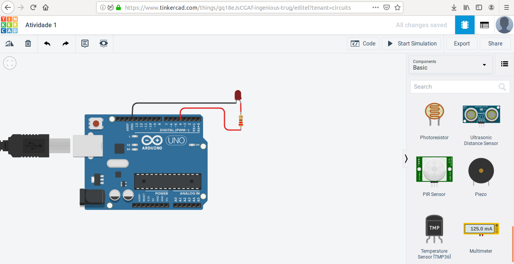

## Primeira atividade - Blink
Nessa atividade iremos usar o TinkerCad Circuits, que será nossa principal ferramente no decorrer das atividades, para produzir um circuito simples para fazer uma led acender.

Então iremos criar um novo circuito no TinkerCad, e iremos começar a montá-lo.


Ao abrirmos o TinkerCad percebemos que na parte direita há uma lista de componenetes eletrônicos.

Dessa lista, iremos usar:
* 1 - Led (qualquer cor)
* 1 - Resistor 220 Ohms
* 1 - Arduino Uno R3


Após a adição dos componentes vamos conecta-lós. Na led há uma das "pernas" que não é reta, se fosse uma led real, essa perna seria um pouco maior que a outra, essa variação de tamanho/forma serve para indicar que é aquela "perna" que irá receber a energia, enquanto a outra é usada como saída. 

Então conecta-se o resistor ao receptor da led e o outro lado da led à qualquer entrada no arduino que esteja indicada como "GND":


Para terminar as conexões do circuito, devemos selecionar uma das portas digitais do arduino, que estão logo acima do "Arduino Uno", e vão de 0 até 13, então temos 14 portas digitais. 

Escolha qualquer uma das portas, a porta utilizada nesse circuito é a porta num 4.



Com o nosso circuito montado, iremos agora adicionar um código para ele, próximo a lista de componentes, na parte superior temos a aba "Code", iremos abri-la e depois selecionar o tipo "Text" e apagar todo o código que está ali para podermos reescrevê-lo.
```C
void setup(){
/*Tudo que estiver nessa função chamada "setup" irá rodar apenas uma vez*/ 

}
void loop(){
/*Tudo que estiver nessa função chamada "loop" irá rodar sempre, enquanto o circuito estiver ligado*/

}
```
Então, temos a estrutura básica de um código em Arduino feita. E agora, como iremos ligar a led?
